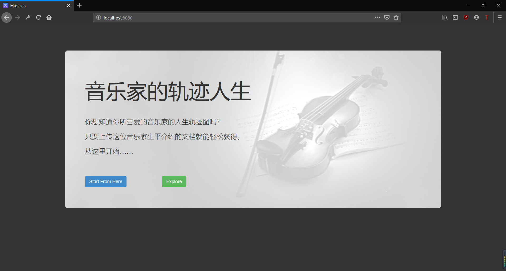

#  <center>期末作业：音乐家人生轨迹和故事自动提取

## 1.目的
- 加强中间件技术的理解和应用；
- 把本学期所学的技术进行深化和理解；
- 从需求、设计到实现的综合工程能力；
- 应用新技术、新框架的（特别是开源软件）的能力


## 2.内容
- 给定某个人物的生平介绍（比如贝多芬）的文档，自动提取实体，绘制该人物的生平和故事。
- 需要用到的知识：
    1. 实体的提取；（何人、何时、何地、发生了何事）    
    知识抽取的概念：    
    https://blog.csdn.net/pelhans/article/details/80020309
    http://ir.hit.edu.cn/~aaliu/share/Unsupervised%20Chinese%20Open%20Entity%20Relation%20Extraction.pdf    
    可参考的框架    
    https://github.com/guillaumegenthial/tf_ner
    http://docs.deeppavlov.ai/en/latest/components/ner.html
    https://github.com/axa-group/nlp.js
    2. 构建前端和网站页面，对人物和故事的时间线的展示
## 3.开发环境
- OS：windows10 pro
- IDE：Pycharm 

## 5.实现过程
### 5.1 数据集选取
爬取Wikipeakia中的所有古典音乐家生平
```python
# 爬取时间段[古典音乐家]---------------------------
html = urlopen(
    "https://zh.wikipedia.org/wiki/%E5%8F%A4%E5%85%B8%E9%9F%B3%E6%A8%82%E4%BD%9C%E6%9B%B2%E5%AE%B6%E5%88%97"
    "%E8%A1%A8 "
).read().decode('utf-8')
# 获取子链接[某时间段]
soup = BeautifulSoup(html, features="html.parser")
i = 0
for node_div in soup.find_all("div", {"class": "hatnote navigation-not-searchable"}):
    period = node_div.find_previous("h2").find("span", {"class": "mw-headline"}).text
    print('\n')
    print('正在爬取' + period + '的音乐家 ...')
    # 爬取音乐家列表[某时间段]---------------------------
    html = urlopen(
        "https://zh.wikipedia.org" + node_div.a['href']
    ).read().decode('utf-8') 
    # 获取子链接[某音乐家]
    soup = BeautifulSoup(html, features="html.parser")
    for node_time in soup.find_all("span", {"class": "mw-headline"}):
        node_h2 = node_time.parent
        node_ul = node_h2.next_sibling
        while node_ul == '\n':
            node_ul = node_ul.next_sibling
        if node_ul.name == 'ul':
            nodes_a = node_ul.find_all("a")
            for node_a in nodes_a:
                if node_a == -1 or node_a is None:
                    continue
                else:
                    html_sub = urlopen(
                        "https://zh.wikipedia.org" + node_a['href']
                    ).read().decode('utf-8')  # if has Chinese, apply decode()
                    soup_sub = BeautifulSoup(html_sub, features="html.parser")
                    list_html = []
                    node_h1 = soup_sub.find("h1", {"class": "firstHeading"})
                    node_card = soup_sub.find("table", {"class": "infobox biography vcard"})
                    node_life = soup_sub.find("span", {"id": "生平"})
                    # 获取全名
                    [s.extract() for s in node_h1.find_all({"class": "mw-editsection"})]
                    title = th2zh(del_bracket(sbc2dbc(node_h1.text)))
                    file_path = out_path + '/' + title + ".txt"
                    print("https://zh.wikipedia.org" + node_a['href'])
                    if node_card == -1 or node_card is None or node_life == -1 or node_life is None:
                        print(title, ": no card/life")
                        continue
                    else:
                        # 获取生平html
                        node_next = node_life.parent.next_sibling
                        while node_next != -1 and node_next is not None and node_next.name != 'h2':
                            if node_next.name == 'p':
                                [s.extract() for s in node_next.find_all('sup')]
                                # 省略代码：替换全名
                                list_html.append(str(node_next))
                            node_next = node_next.next_sibling
```
### 5.2 数据预处理
#### 5.2.1 通用处理
繁体转简体 
```python
def th2zh(str_data):
    if str_data is None:
        return str_data
    else:
        return zhconv.convert(str_data, 'zh-cn')
```
中英字符转换（解决字符不配对等问题）
```python
def sbc2dbc(str_data):
    list_char = [('【', '['), ('】', ']'), ('｢', '“'), ('｣', "”"), (',', '，'), ('?', '？'), ('!', '！'), ('(', '（'),
                 (')', '）'), (':', '：'), ('-', '-'),('—','-')]
    for i in range(len(list_char)):
        str_data = str_data.replace(list_char[i][0], list_char[i][1])
    return str_data
```
转换干扰内容（解决对书名/谈话等内容错误的实体识别）
```python
def short_data(sentence):
    ## 识别前简化书名/括号间内容
    int_symbol = 0
    sentence2 = ""
    str_symbol = ""
    list_symbol = []
    set_symbol = {('《', '》'), ('“', '”'), ('｢', '｣'), ('[', ']')}
    for c in sentence:
        if c in [tuple_symbol[0] for tuple_symbol in set_symbol]:
            int_symbol += 1
            if int_symbol == 1:
                sentence2 += c + "简化"
                str_symbol += c
                continue
        elif c in [tuple_symbol[1] for tuple_symbol in set_symbol]:
            int_symbol -= 1
            if int_symbol == 0:
                sentence2 += c
                str_symbol += c
                list_symbol.append(str_symbol)
                str_symbol = ""
                continue
        if int_symbol != 0:
            str_symbol += c
        if int_symbol == 0:
            sentence2 += c
    return sentence2, list_symbol

def long_data(para, list_symbol):
    ## 识别后还原
    if len(list_symbol) > 0:
        list_symbol.reverse()
        rev_list_symbol = list_symbol
        for i in range(len(para)):
            j = 0
            int_length = len(para[i])
            while j + 3 < int_length and len(rev_list_symbol) != 0:
                if para[i][j] == rev_list_symbol[-1][0] and para[i][j + 3] == rev_list_symbol[-1][-1]:
                    str_add = rev_list_symbol.pop()[1:-1]
                    para[i] = para[i][0:j + 1] + str_add + para[i][j + 3:]
                    j += len(str_add) + 1
                    int_length = len(para[i])
                else:
                    j += 1
    return para
```
分句
```python
def cut_sent(para):
    para = re.sub('([。！？；\?])([^”’])', r"\1\n\2", para)  # 单字符断句符
    para = re.sub('(\.{6})([^”’])', r"\1\n\2", para)  # 英文省略号
    para = re.sub('(\…{2})([^”’])', r"\1\n\2", para)  # 中文省略号
    para = re.sub('([。！？\?][”’])([^，。！？\?])', r'\1\n\2', para)
    para = para.rstrip()
    para = para.split('\n')
    return para
```
#### 5.2.2 时间预处理
中英数字转换
```python
def zh2number(str_phrase):
    all_zh = re.findall('[一二两三四五六七八九零十百千万亿]+', str_phrase)
    map_num = {'零': 0, '一': 1, '二': 2, '两': 2, '三': 3, '四': 4, '五': 5, '六': 6, '七': 7, '八': 8, '九': 9, '十': 10,
               '百': 100, '千': 1000, '万': 10000, '亿': 100000000}

    for str_zh in all_zh:
        str_num = ""
        if not bool(set('十百千万亿').intersection(str_zh)):
            for i in range(len(str_zh)):
                val = map_num.get(str_zh[i])
                str_num += str(val)
        else:
            total = 0
            r = 1  # 表示单位：个十百千...
            for i in range(len(str_zh) - 1, -1, -1):
                val = map_num.get(str_zh[i])
                if val >= 10 and i == 0:  # 应对 十三 十四 十*之类
                    if val > r:
                        r = val
                        total = total + val
                    else:
                        r = r * val
                        # total =total + r * x
                elif val >= 10:
                    if val > r:
                        r = val
                    else:
                        r = r * val
                else:
                    total = total + r * val
            str_num = str(total)
        str_phrase = str_phrase.replace(str_zh, str_num, 1)
    return str_phrase
```
岁数转时间
```python
def set_birth(self, sentences):
    set_birth = {'生于'}
    set_death = {'死于', '去世', '逝世', '病逝', '离开了人世', '离开人世', '离世', '辞世'}
    set_exp = {'之后', '后'}
    for sentence in sentences:
        if self.int_birth != 0:
            break
        if sentence != "":
            sentence, list_symbol = utils.short_data(sentence)
            for str_birth in set_birth:
                if str_birth in sentence:
                    mat_year4 = re.findall(r"(\d{4}年)", sentence)
                    if len(mat_year4) != 0:
                        self.int_birth = int((mat_year4[0].strip("年")).encode("utf-8"))
                        break
            for str_death in set_death:
                index = sentence.find(str_death)
                if index > 0 and sentence[index + len(str_death):index + len(str_death)] not in set_exp:
                    mat_year4 = re.findall(r"(\d{4}年)", sentence)
                    mat_old = re.findall(r"(\d{2,3}岁)", sentence)
                    if len(mat_year4) != 0 and len(mat_old) != 0:
                        int_death = int((mat_year4[-1].strip("年")).encode("utf-8"))
                        int_old = int((mat_old[-1].strip("岁")).encode("utf-8"))
                        self.int_birth = int_death - int_old
                        break

def age2year(birth, sent):
    year = re.findall('(\d{4}年)', sent)
    if len(year) == 0:
        ages = re.findall('(\d+岁)', sent)
        for i in range(len(ages)):
            age = int(ages[i][:-1])
            if len(birth) >= 4:
                sent = sent.replace(ages[i], str(int(birth[:4]) + age) + "年")
    return sent

```
标准化时间
```python
match = re.findall('(\d{4}年)', line)
for i in range(len(match)):
    year = match[i]
    line = line.replace(year, year[:4])
match = re.findall('(\d{4})', line)
for i in range(len(match)):
    year = match[i]
    line = line.replace(year, year + '年')
match = re.findall('(\d{4}年至\d{4})', line)
for i in range(len(match)):
    year = match[i]
    line = line.replace(year, year.replace('至', '-'))
match = re.findall('(\d{4}年到\d{4})', line)
for i in range(len(match)):
    year = match[i]
    line = line.replace(year, year.replace('到', '-'))
```
#### 5.2.3 人名预处理
替换代词
```python
for i in range(len(line)):
                if line[i] == '他' or line[i] == '她' and i < len(line) - 1 and line[i + 1] != "们":
                    if i > 0 and line[i - 1] == "吉":
                        line1 += line[i]
                    else:
                        line1 += allname + line[i + 1:]
                        break
                else:
                    line1 += line[i]
```
人名补全（解决无法识别只出现名字的音乐家人名实体问题）
```python
while True:
    index = line.find(firstname, start)
    if index == -1:
        line2 += line[start:]
        break
    elif index == 0:
        line2 += line[start:index] + allname
        start = index + len(firstname)
    elif index > 0 and line[index - 1] != '·':
        line2 += line[start:index] + allname
        start = index + len(firstname)
    else:
        line2 += line[start:index] + firstname
        start = index + len(firstname)
```
### 5.2 实体识别
采用StanfordNLP进行命名实体识别
- StanfordNLP 结合了斯坦福团队参加CoNLL 2018使用的软件包，和Stanford CoreNLP软件的官方Python接口
- StanfordNLP 包含进行文本分析的完整神经网络管道（neural network pipeline）
- StanfordNLP 在big-treebanks官方评估指标LAS、MLAS和BLEX上获得了第2名、第1名和第3名，并且在所有指标上大幅度地优于低资源treebank类别的所有提交系统。
```python
self.nlp = StanfordCoreNLP('http://localhost',  port=9000, lang='zh')
self.props = {'annotators': 'ner', 'pipelineLanguage': 'zh', 'outputFormat': 'xml'}
tuple_ners = self.nlp.ner(sentence)
# 转换原格式
ners = []
for tuple_ner in tuple_ners:
    ners.append(list(tuple_ner))
list_date, list_date_pos = self.__get_date(ners)
list_per, list_per_pos = self.__get_per(ners)
list_loc, list_loc_pos = self.__get_loc(ners)
```
时间实体识别
```python
def __get_date(self, ners):
    # 提取时间实体
    list_date = []
    list_date_pos = []
    int_age = 0
    for i in range(len(ners)):
        if ners[i][1] == 'DATE' and len(set(ners[i][0]).difference(set(ners[i][0]).intersection(set_date))) != 0:
            ners[i][1] = 'TMP_DATE'
        if i > 0 and ners[i][1] == 'DATE' and ners[i - 1][1] == 'DATE':
            pop_word = list_date.pop()
            list_date.append(pop_word + ners[i][0])
        elif 0 < i < len(ners) - 1 and ners[i][0] == '的' and ners[i - 1][1] == 'DATE' and ners[i + 1][1] == 'DATE':
            pop_word = list_date.pop()
            list_date.append(pop_word + ners[i][0])
        elif ners[i][1] == 'DATE':
            list_date.append(ners[i][0])
            list_date_pos.append(int(i))
    # 补全年(月日)
    for i in range(len(list_date)):
        index = list_date[i].find('-')
        if index >= 0:
            if list_date[i][index - 1] in set_num:
                list_date[i] = list_date[i][:index] + list_date[i][-1] + list_date[i][index:]
    for i in range(len(list_date)):
        list_date[i] = list_date[i].replace("的", "")
        list_date[i] = list_date[i].replace("月份", "月")
        if "年" in list_date[i]:
            mat_year2 = re.findall(r"(\d{2}年)", list_date[i])
            mat_year3 = re.findall(r"(\d{3}年)", list_date[i])
            mat_year4 = re.findall(r"(\d{4}年)", list_date[i])
            set_year2 = set(mat_year2).difference(set(mat_year4)).difference(set(mat_year3))
            if len(mat_year4) != 0:
                self.last_year = mat_year4[-1]
            elif len(set_year2) != 0:
                for item in set_year2:
                    list_date[i] = list_date[i].replace(item, self.last_year[0] + self.last_year[1] + item)
        elif "月" in list_date[i] and self.last_year != "":
            list_date[i] = self.last_year + list_date[i]
    # 省略代码：剔除不满足时间实体
    return list_date_format, list_date_format_pos
```

人名实体识别
```python
def __get_per(ners):
    list_per = []
    list_per_pos = []
    set_not = {'们'}
    set_name = {'.', '·', ' '}
    for i in range(len(ners)):
        if i + 2 < len(ners) and ners[i + 1][0] in set_name:
            if ners[i][1] == 'PERSON' \
                    or (ners[i][0].encode('UTF-8').isalpha() and len(ners[i][0]) == 1) \
                    or ners[i + 2][1] == 'PERSON' \
                    or (ners[i + 2][0].encode('UTF-8').isalpha() and len(ners[i + 2][0]) == 1) \
                    :
                ners[i][1] = 'PERSON'
                ners[i + 1][1] = 'PERSON'
                ners[i + 2][1] = 'PERSON'
        elif i + 2 < len(ners) and ners[i + 1][0][0] in set_name:
            if ners[i][1] == 'PERSON' \
                    or (ners[i][0].encode('UTF-8').isalpha() and len(ners[i][0]) == 1) \
                    or ners[i + 1][1] == 'PERSON':
                ners[i][1] = 'PERSON'
                ners[i + 1][1] = 'PERSON'
        elif i + 1 < len(ners) and ners[i][0][-1] in set_name:
            if ners[i][1] == 'PERSON' \
                    or ners[i + 1][1] == 'PERSON' \
                    or (ners[i + 1][0].encode('UTF-8').isalpha() and len(ners[i + 1][0]) == 1) \
                    :
                ners[i][1] = 'PERSON'
                ners[i + 1][1] = 'PERSON'
        if ners[i][1] == 'PERSON' and ners[i - 1][1] == 'PERSON':
            pop_word = list_per.pop()
            list_per.append(pop_word + ners[i][0])
        elif ners[i][1] == 'PERSON':
            list_per.append(ners[i][0])
            list_per_pos.append(int(i))
    # 省略代码：剔除不满足实体
    return list_per_format, list_per_format_pos

```
地名实体识别
```python
for i in range(len(ners)):
    if ners[i][1] == 'CITY' or ners[i][1] == 'COUNTRY' and len(ners[i][0]) > 1:
        list_loc.append(ners[i][0])
        list_loc_pos.append(int(i))
```
### 5.3 地理编码
采用geopy进行地理编码
```python
geocode = geolocator.geocode(loc, language='zh-CN', timeout=20)
```


## 6.结果截图
xxxx截图



